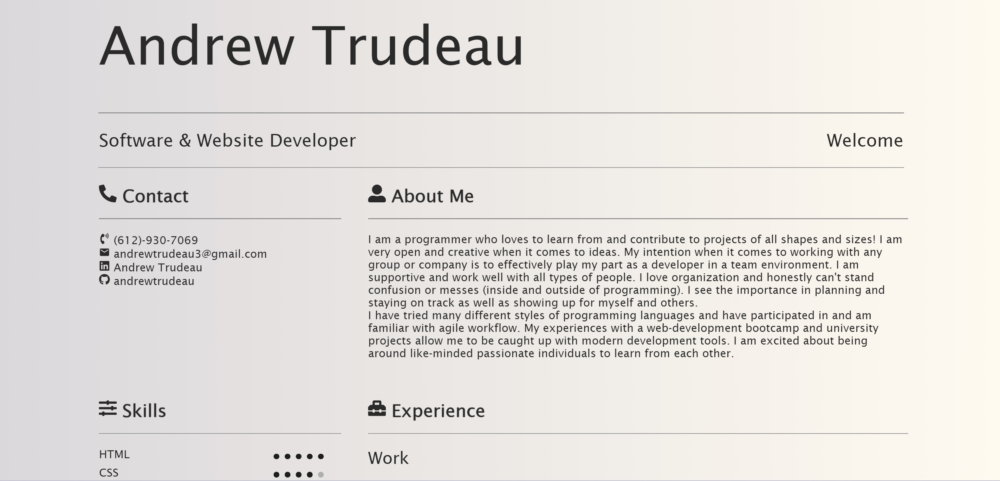

# Andrew Trudeau's Portfolio

## Objective 

This project is a resume created using React.

## Instructions & Usage

Using the deployed link, open the webpage and browse it.

## Screenshot

## Links

[Github](https://github.com/andrewtrudeau/20-React-Portfolio)

[Website](https://andrewtrudeau.github.io/trudeau-resume/)
(Deployed using GitHub Pages)

## Contact

If you wish to reach me for questions, please refer to the contact information below:

Github Profile: [andrewtrudeau](https://github.com/andrewtrudeau)

Email Me: [andrewtrudeau3@gmail.com](mailto:andrewtrudeau3@gmail.com)